# DebugProbe.AspNetCore — Lightweight Feature Proposal

This document proposes 7 lightweight features for `DebugProbe.AspNetCore`. Every feature reuses the existing architecture (`DebugEntryStore`, `HtmlRenderer`, `DebugEntry`, `DebugOutgoingRequest`) — **no new external dependencies, no database, no infra**. Advanced capabilities (dashboards, analytics, storage, management) remain out of scope for the package and are deferred to `DebugProbe.Server`.

---

## 🎯 Why These Features?

Every feature below passes three filters:

1. **Zero new infra** — no EF Core, no external DB, same in-memory `DebugEntryStore` philosophy.
2. **Immediate developer value** — usable the moment it ships, no configuration overhead.
3. **Reuses existing data** — everything needed is already captured in `DebugEntry` / `DebugOutgoingRequest`.

---

## 🗺️ Feature Overview

1. cURL Export
2. Copy as C# HttpClient Snippet
3. Exception Fingerprinting & Grouping
4. Slow Request / Dependency Badge
5. Dark / Light Theme Toggle
6. Markdown Export of a Trace
7. URL-Persistent Filters

---

## 1. cURL Export

**Why it matters:** A developer looking at a captured request in the dashboard often wants to test it themselves — right now that means manually rebuilding it in Postman or a terminal. A one-click "Copy as cURL" turns the dashboard from a viewer into a working tool.

**How it works:** `DebugOutgoingRequest` (and the incoming request on `DebugEntry`) already stores Method, URL, Headers, and Body. This is pure string templating on the client — no backend change required.

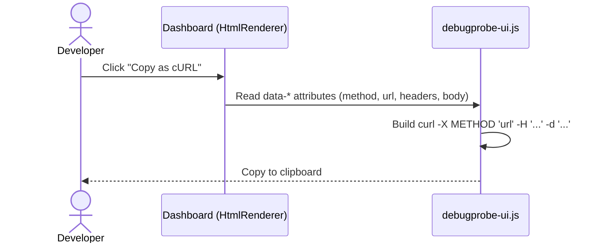

**Implementation notes:**
- Add `data-method`, `data-url`, `data-headers`, `data-body` attributes to request/response cards in `HtmlRenderer.RenderDetailsPage`.
- Add a `copyAsCurl(el)` function in `debugprobe-ui.js`.
- No new endpoint needed.

---

## 2. Copy as C# HttpClient Snippet

**Why it matters:** Most DebugProbe users are .NET developers. A cURL command still needs mental translation back into C#. A "Copy as C#" button generates a ready-to-paste `HttpClient` snippet — closing the loop for the exact audience using the package.

**How it works:** Same source data as cURL export (Method, URL, Headers, Body), just a different string template targeting C# syntax.

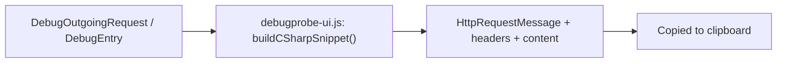

**Example output:**
```csharp
var request = new HttpRequestMessage(HttpMethod.Post, "https://api.example.com/orders");
request.Headers.Add("Authorization", "Bearer ...");
request.Content = new StringContent("{...}", Encoding.UTF8, "application/json");
var response = await httpClient.SendAsync(request);
```

**Implementation notes:**
- Shares the same data attributes as the cURL feature — one shared parsing function, two output templates.
- Zero backend involvement; pure client-side generation.

---

## 3. Exception Fingerprinting & Grouping

**Why it matters:** When something breaks, developers currently scroll through a flat list of exceptions one at a time. Grouping identical/similar exceptions (same type + message) into a single count immediately surfaces "this is happening a lot" versus "this happened once."

**How it works:** `DebugEntry` already captures exception type and message. A lightweight fingerprint (hash of type + normalized message) is computed and tallied in a `ConcurrentDictionary<string, int>` inside `DebugEntryStore` — no new storage layer, same in-memory model.

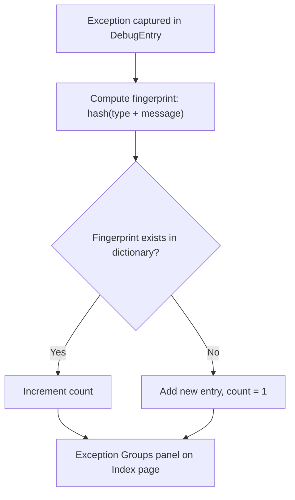

**Implementation notes:**
- Add `ConcurrentDictionary<string, ExceptionGroup>` to `DebugEntryStore`, updated alongside the existing `ConcurrentQueue`.
- `ExceptionGroup` = `{ Fingerprint, Type, SampleMessage, Count, LastSeen }`.
- Render as a small summary panel above the request table in `HtmlRenderer.RenderIndexPage`.

---

## 4. Slow Request / Dependency Badge

**Why it matters:** Spotting a slow request currently requires reading a duration column carefully. A visual badge makes performance problems jump out at a glance — both for the parent request and for individual outgoing dependencies inside the waterfall.

**How it works:** `HtmlRenderer` already computes durations for both the incoming request and each `DebugOutgoingRequest`. A configurable threshold (`SlowRequestThresholdMs`) decides when to render a "🐢 Slow" badge.

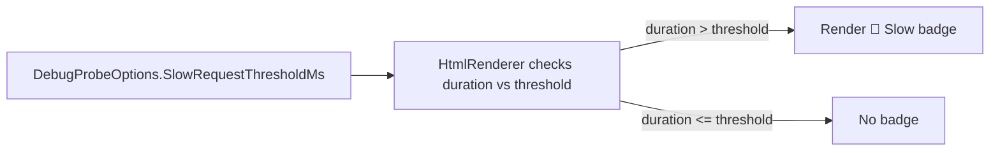

**Implementation notes:**
- New option: `SlowRequestThresholdMs` (default e.g. `1000`) in `DebugProbeOptions.cs`.
- Apply the same check inside the waterfall bar rendering (Phase 1/2) so slow **dependencies**, not just slow requests, get flagged.
- CSS-only badge styling, no JS required.

---

## 5. Dark / Light Theme Toggle

**Why it matters:** The dashboard is used during active debugging sessions, often for long stretches. Letting developers pick their preferred theme is a small but consistently appreciated quality-of-life feature — and it's practically free, since `debugprobe.css` already uses CSS variables for theming.

**How it works:** A toggle button flips a `data-theme` attribute on the root element; CSS variables already defined for the dark waterfall/tooltip styling are extended to cover the full page.

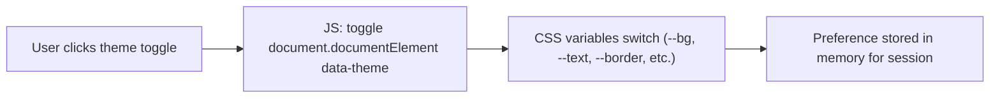

**Implementation notes:**
- Extend existing CSS variables in `debugprobe.css` to cover light + dark palettes.
- Add toggle button to `layout.html`.
- Since browser storage is out of scope for a minimal package, keep the preference session-only (resets on reload) — or optionally persist server-side via a query param, matching the "no localStorage" constraint if applicable to this environment.

---

## 6. Markdown Export of a Trace

**Why it matters:** Developers regularly need to paste request/response details into a GitHub issue, PR description, or Slack message. A "Copy as Markdown" button generates a clean, readable block instead of a messy screenshot or manual copy-paste.

**How it works:** Pure string templating from data already rendered on the details page (headers, body, status, duration, outgoing calls).

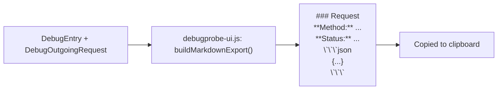

**Example output:**
```markdown
### POST /api/orders — 500 (1.84s)

**Request Body:**
​```json
{ "orderId": 123 }
​```

**Response Body:**
​```json
{ "error": "Timeout" }
​```
```

**Implementation notes:**
- Reuses the same data source as cURL/C# export — three export formats, one shared data-reading function.
- No new endpoint; entirely client-side.

---

## 7. URL-Persistent Filters

**Why it matters:** The index page already supports filtering by method/status, but the filtered view disappears on refresh and can't be shared. Reflecting filters in the URL query string turns a local filter into a shareable, bookmarkable link — useful for pointing a teammate straight at "all 5xx errors on staging."

**How it works:** Pure frontend change — existing filter JS reads/writes `URLSearchParams` on filter change and on page load.

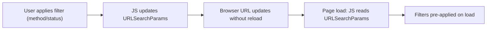

**Implementation notes:**
- Update `debugprobe-ui.js` filter handlers to call `history.replaceState` with updated query params.
- On `DOMContentLoaded`, read `window.location.search` and apply filters before rendering the table.
- No backend involvement — `/debug` endpoint stays the same, filtering remains client-side.

---

## ➕ Additional Features (Phase 2)

### UI/UX

## 8. Keyboard Shortcuts

**Why it matters:** Developers debugging a production issue often bounce between search, a specific trace, and copying data out of it. Reaching for the mouse every time slows that loop down. A handful of keyboard shortcuts make the dashboard feel like a tool built for repeated, fast use rather than a one-off viewer.

**How it works:** A single global `keydown` listener in `debugprobe-ui.js` checks the pressed key and the currently focused/open element, then triggers the same functions already wired to their respective buttons (search focus, close details, copy cURL).

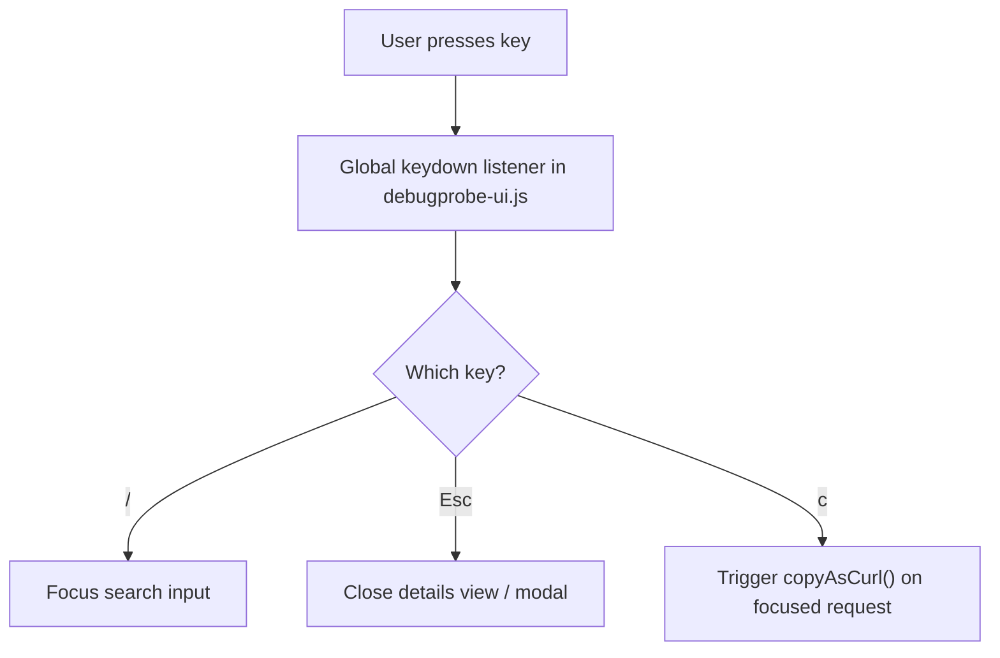

**Implementation notes:**
- Skip shortcut handling when focus is inside a text input/textarea (except `Esc`), to avoid hijacking normal typing.
- Reuses existing functions (`copyAsCurl`, search box focus, details view close) — no new logic, just new entry points into it.
- No backend involvement.

---

## 9. Pin / Favorite a Trace

**Why it matters:** `DebugEntryStore` is a bounded queue — older entries get evicted as new traffic comes in. During an active debugging session, the one trace a developer cares about can easily scroll out of view or get pushed out of the queue entirely. Pinning keeps an important trace visible and safe from casual loss.

**How it works:** A boolean `IsPinned` flag is added to `DebugEntry`. The index page renders pinned entries in a separate "Pinned" section at the top, regardless of their position in the underlying queue. This stays in-memory only — no persistence beyond the process lifetime.

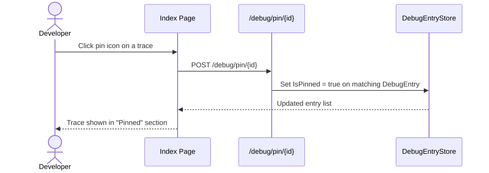

**Implementation notes:**
- Add `IsPinned` (bool) to `DebugEntry.cs`.
- New minimal endpoint `/debug/pin/{id}` (toggle) registered alongside existing routes in `DebugProbeExtensions.cs`.
- Eviction logic in `DebugEntryStore` should skip pinned entries when trimming to `MaxEntries`, or cap how many pinned entries are allowed to avoid unbounded memory growth.
- No external storage — pin state disappears on app restart, consistent with the rest of the package's in-memory model.

---

## 10. Redaction Preview Toggle

**Why it matters:** Redaction (`RedactionUtils`) hides sensitive header/query/JSON values by design — but during local development, a developer often needs to briefly confirm what the *real* value was (e.g. to check a token expired vs was malformed). Right now there's no safe way to peek without disabling redaction globally.

**How it works:** A toggle on the details page temporarily reveals the original values, but only when the running environment is detected as local/development via the existing `EnvironmentUtils` check. The redaction pipeline itself is untouched — this only affects what's rendered in the UI, and only in safe environments.

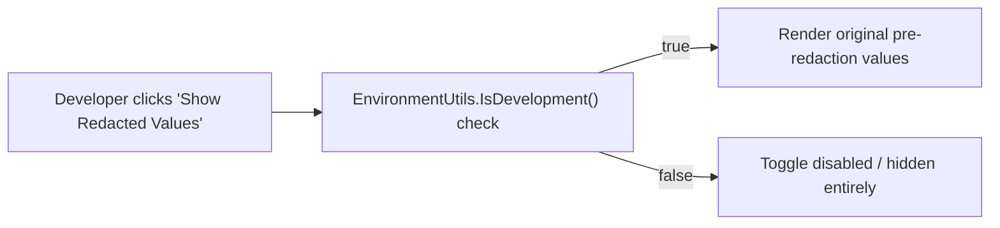

**Implementation notes:**
- Requires storing both the redacted *and* original values in memory for the toggle to work — a deliberate trade-off, so this should be opt-in via a config flag (e.g. `AllowRedactionPreview`) defaulting to `false`.
- Toggle button is hidden entirely outside of development environments — not just disabled, to avoid signaling its existence in production.
- No change to `RedactionUtils` itself; this is purely an additional rendering path in `HtmlRenderer`.

---

### Meta / Telemetry

## 11. Request Rate Sparkline

**Why it matters:** The index page currently shows totals (total requests, error rate) but no sense of *shape* — was there a traffic spike five minutes ago? A tiny inline chart gives an at-a-glance read on recent traffic patterns without needing a full analytics dashboard (which belongs in `DebugProbe.Server`).

**How it works:** Timestamps are already stored on every `DebugEntry`. A lightweight aggregation buckets entries into per-minute counts over the last N minutes, and a small inline SVG polyline renders the trend — no charting library required.

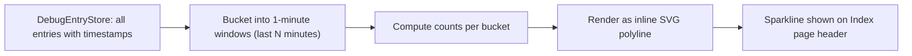

**Implementation notes:**
- Aggregation happens on-demand when the index page renders — no background job, no additional storage.
- Hand-rolled SVG `<polyline>` keeps this dependency-free (no charting library needed for something this small).
- `N` (lookback window) can be a fixed constant or a small config option.

---

## 12. Environment Diff Badge

**Why it matters:** A common class of bug is "works in staging, breaks in production" (or vice versa) for the exact same endpoint. Surfacing that mismatch automatically — instead of requiring a developer to manually trigger a compare — turns a reactive tool into a proactive one.

**How it works:** This reuses the existing compare engine (`DebugEntryComparer`) that already powers the manual compare feature. When two entries share the same route across different environments, the same diffing logic runs automatically and a badge appears if differences are found.

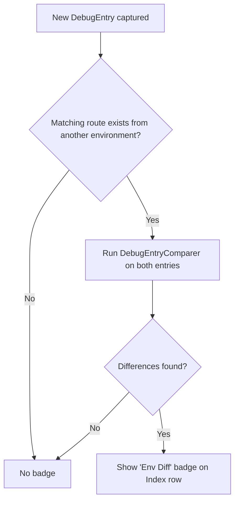

**Implementation notes:**
- Requires a way to identify "the same route" across environments — likely matching on normalized path + method, tagged with the environment name already available via `DebugEnvironment`.
- Runs the existing `DebugEntryComparer` rather than introducing new diffing logic.
- Should be opt-in (config flag) since automatic cross-entry comparison adds a small amount of CPU work per request; can be skipped in high-throughput scenarios.

---

## 13. Error Rate Trend Indicator

**Why it matters:** Knowing the current error rate is useful; knowing whether it's *getting worse* is more useful. A small trend arrow next to the existing error rate metric gives an instant read on direction without needing a chart or a trip to `DebugProbe.Server`'s analytics.

**How it works:** `HtmlRenderer.RenderIndexPage` already computes the current error rate. This adds a second computation over the *previous* comparable time window and renders a simple ↑ (worse) or ↓ (better) arrow next to the existing metric.

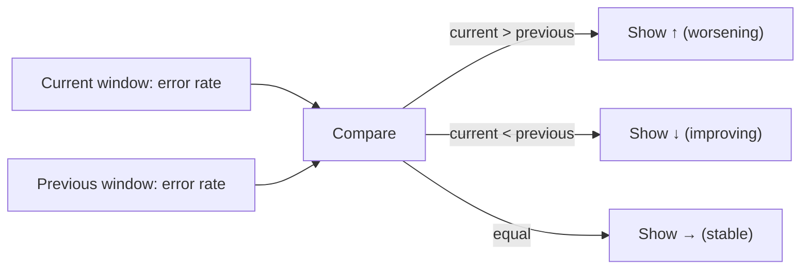

**Implementation notes:**
- Both windows are computed from data already in `DebugEntryStore` — no new capture or storage.
- Window size (e.g. "last 10 minutes vs the 10 minutes before that") can reuse whatever lookback constant is chosen for the Request Rate Sparkline, keeping the two features consistent.
- Purely additive to the existing metrics row in `HtmlRenderer.RenderIndexPage`.

---

### Safety Nets

## 14. Replay Warning for Non-GET

**Why it matters:** If a future "replay this request" capability is added to the package, blindly re-firing a POST/PUT/DELETE could re-trigger a real side effect — creating a duplicate order, re-sending a payment, deleting a resource again. A confirmation step is a small guard that prevents an accidental click from causing real damage.

**How it works:** Before any replay action executes, the UI checks the HTTP method of the original request. GET (and other safe/idempotent methods) proceed immediately; anything else shows a confirmation modal first.

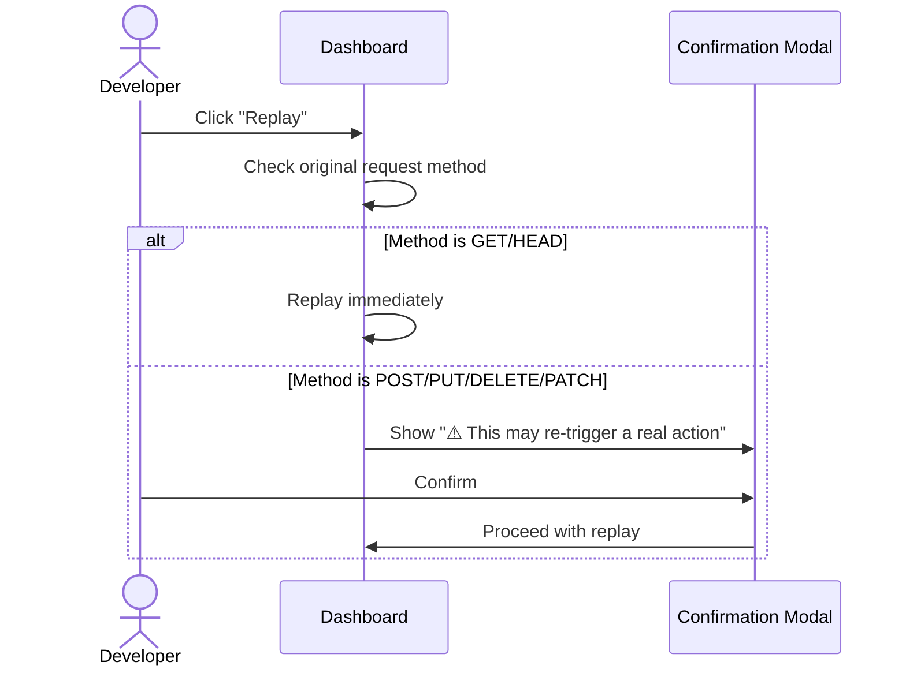

**Implementation notes:**
- This feature is a **guard**, not a standalone capability — it only becomes relevant once a replay/resend feature exists in the package.
- Implemented as a simple client-side method check plus a confirmation modal; no backend logic required beyond whatever the (future) replay endpoint itself needs.
- Worth building at the same time as any replay feature, rather than bolted on afterward, so the warning can't accidentally be skipped.
