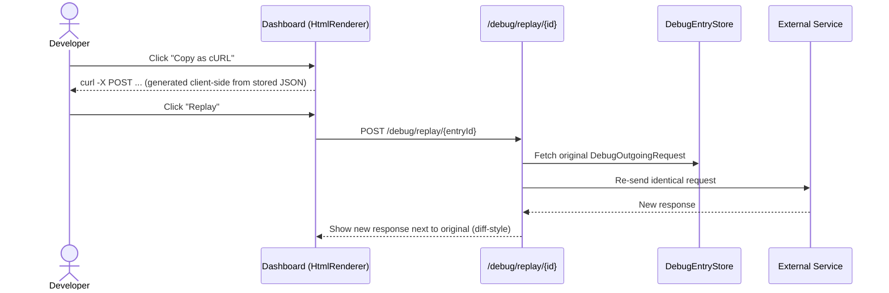
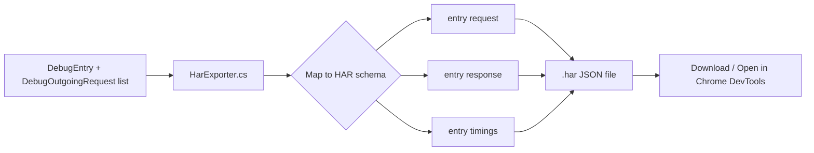
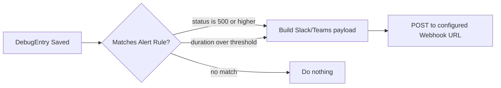
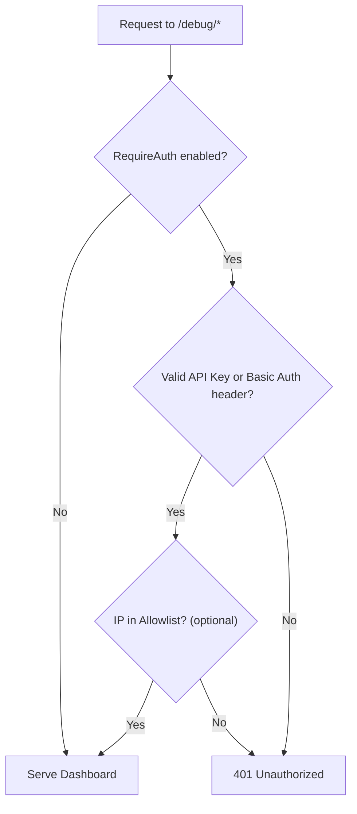
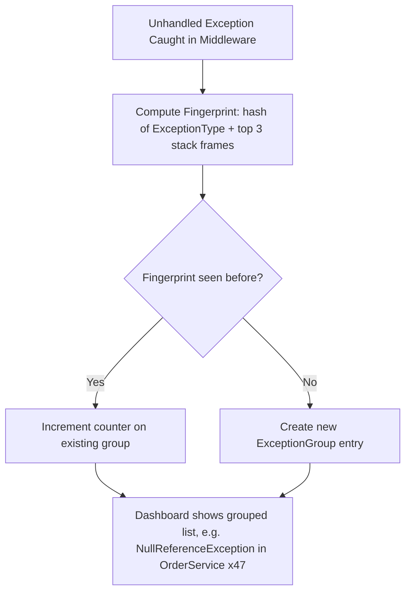
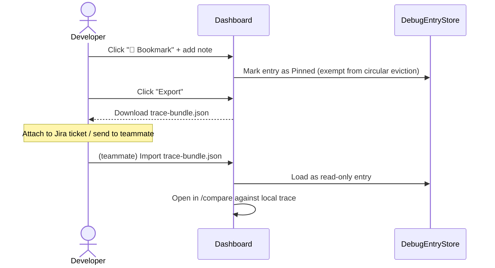
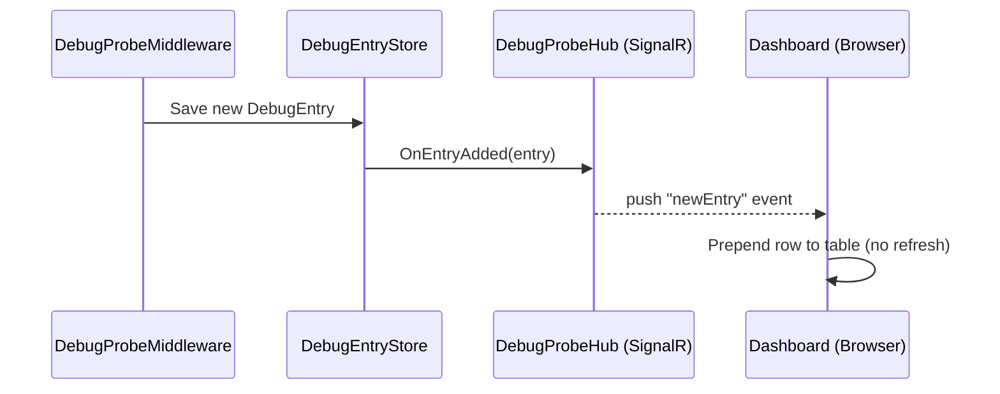
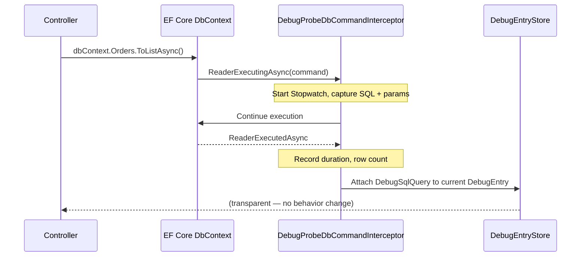

# DebugProbe.AspNetCore — Proposed Additional Features

> Waterfall Timeline (Phase 1 & 2) is done. This document proposes the next set of features to build on top of it — what they are, why they matter, and how they'd fit into the existing architecture.

---

## 🎯 Why These Features?

Every feature below was picked using three filters:

1. **Reuses existing architecture** — no new infra, no external DB, same in-memory `DebugEntryStore` philosophy.
2. **High "aha!" moment** — the kind of feature a developer screenshots and shares with their team.
3. **Closes real gaps** — DebugProbe currently captures HTTP in/out beautifully, but has no DB visibility, no real-time push, no security story, and no way to share a trace with a teammate.

---

## 🗺️ Feature Overview

1. cURL Export + One-Click Replay
2. HAR File Export
3. Webhook Alerts (Slack/Teams/Discord)
4. Dashboard Security (Auth + IP Allowlist)
5. Exception Fingerprinting & Grouping
6. Trace Bookmarks, Notes & Shareable Export
7. Live Tail Dashboard (SignalR push)
8. EF Core / SQL Query Capture

---

## 1. cURL Export + One-Click Replay

**Why it matters:** Right now a developer can *see* an outgoing request in the waterfall, but if they want to test it themselves, they have to manually rebuild it in Postman. Generating a copy-pasteable `curl` command — and a "Replay" button that re-fires the exact request — turns DebugProbe from a *viewer* into a *tool*.

**How it works:** You already capture method, URL, headers, and body in `DebugOutgoingRequest`. This is pure string templating + one new endpoint that reuses `HttpClient` to resend the payload.

**Gotcha:** Replay is only truly safe for idempotent calls (GET). For POST/PUT (e.g. payment or order creation), replaying can re-trigger real side-effects — add a "⚠️ this will re-trigger the action" warning in the UI before firing.

---

## 2. HAR File Export

**Why it matters:** HAR (HTTP Archive) is the industry-standard format Chrome DevTools, Postman, and Charles Proxy all understand. Exporting a trace as `.har` means a developer can drag-and-drop it straight into tools their team already uses.

**How it works:** Pure data-mapping from objects already in memory. No new capture logic needed.

---

## 3. Webhook Alerts (Slack / Teams / Discord)

**Why it matters:** Turns DebugProbe from "something I check" into "something that taps me on the shoulder." A simple rule engine — "notify if status ≥ 500" or "notify if outgoing call > 2000ms" — posts a formatted card to a webhook URL.

**How it works:** One options class (`AlertRules`) + `HttpClient.PostAsync` on save. No new state to manage.

---

## 4. Dashboard Security (Basic Auth / API Key / IP Allowlist)

**Why it matters:** This is the feature a *maintainer* cares about even more than end users. Right now, anyone who can reach `/debug` can see full request/response bodies, including potentially sensitive data. Before this tool can be recommended for staging/prod use, it needs a simple, opt-in auth gate.

**How it works:** A small middleware check inserted before `DebugProbeMiddleware` continues to `HtmlRenderer` — same pattern ASP.NET Core apps already use everywhere.

---

## 5. Exception Fingerprinting & Grouping

**Why it matters:** When something breaks in a loop or under load, a developer currently sees 50 nearly-identical entries in the trace list. Grouping them by a "fingerprint" (hash of exception type + stack trace top frames) turns noise into a clean "This error happened 47 times" summary — similar to what tools like Sentry do, but built into your own app.

**Gotcha:** Deciding how many stack frames to hash needs some trial-and-error — too many frames makes groups overly specific, too few merges unrelated errors together.

---

## 6. Trace Bookmarks, Notes & Shareable Export

**Why it matters:** Ties directly into the existing **Trace Comparison View**. Right now traces disappear once the circular queue evicts them. Letting a developer "pin" an interesting trace, attach a note ("this is the race condition from ticket #482"), and export it as a portable `.json` bundle means it can be attached to a bug ticket or Slack message — and re-imported into someone else's DebugProbe instance for comparison.

**How it works:** Mostly UI + serialization; the store already supports the shape of this data.

---

## 7. Live Tail Dashboard (SignalR Push)

**Why it matters:** Today the dashboard has to be manually refreshed to see new requests. A "Live Tail" mode (toggle switch, like `tail -f`) that streams new `DebugEntry` items the moment they're captured makes the tool feel alive — great for demoing or watching a flaky endpoint in real time.

**Gotcha:** `DebugEntryStore` is already a thread-safe circular queue — wiring a push-event system on top of it, and keeping multiple open browser tabs in sync, needs a bit more testing than a typical UI feature.

---

## 8. EF Core / SQL Query Capture

**Why it matters:** This is the **flagship feature** on this list. The outgoing-HTTP capture (via `DebugProbeHttpClientHandler`) already proves the "intercept and record" pattern works beautifully. Applying the same idea to database calls — via EF Core's interceptor API — lets developers see **SQL queries, duration, and even N+1 query detection** right next to the HTTP waterfall. This single feature elevates DebugProbe from "an HTTP debugger" to "a full request-lifecycle debugger."

**Bonus (optional, ship separately):** If the same normalized query template runs 3+ times inside one request, flag it visually as a likely N+1 issue.

**Gotcha:** Conceptually similar to the HttpClientHandler, but practically harder because:
1. EF Core's interceptor API differs slightly across versions (5/6/7/8).
2. Async streaming queries (`IAsyncEnumerable`) are trickier to time correctly than a simple request/response cycle.
3. The captured SQL data then needs to be visually merged into the *existing* waterfall timeline alongside HTTP calls — so it's also an integration task on top of the waterfall, not just a standalone capture feature.

---
