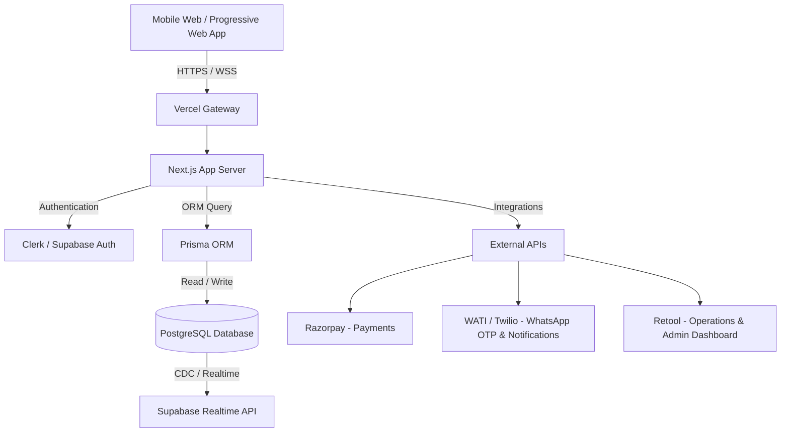

# 🚀 Shakti: India's Managed Growth Engine for Micro-Businesses & Women Entrepreneurs

> **"IndiaMART connects. JustDial lists. Shakti delivers deals."**

Shakti is a next-generation **Managed B2B Marketplace and Growth-as-a-Service (GaaS) platform** designed specifically for India’s micro-business owners and service providers. Unlike traditional directories that charge hefty upfront fees just to send spammy, unverified leads, Shakti acts as an active growth partner—verifying service providers, standardizing service offerings, and securing B2B contracts, franchise partnerships, and growth opportunities.

By offering a hyper-affordable subscription model and a specialized, high-impact channel for women entrepreneurs, Shakti is democratizing access to business growth for India’s next 50 million small businesses.

---

## 📌 Executive Summary & Market Gap

### 🏢 The Landscape & The Problem
India's existing B2B and local directories (IndiaMART, JustDial, Sulekha, Solv, Udaan) suffer from deep structural limitations when it comes to supporting small, service-oriented businesses:

| Platform | Core Focus | Pricing Model | Key Gaps & Pain Points |
| :--- | :--- | :--- | :--- |
| **IndiaMART** | B2B Products & Suppliers | ₹28,000 - ₹60,000/year (Upfront) | Product-focused; service businesses struggle; extremely expensive for micro-vendors; massive spam leads. |
| **JustDial** | Local Business Directory | ₹15,000 - ₹50,000/year | Static listings only; conversion rate is extremely low (3-5%); lead bidding war drains small budgets. |
| **Sulekha** | B2C Home Services | Pay-per-lead / Commission | Focuses purely on consumer services; lacks B2B partnerships or long-term growth opportunities. |
| **Udaan** | B2B Wholesale Commerce | Transaction Commissions | Built purely for physical goods and retail supply chains; zero service integration. |
| **Anar** | B2B Networking | Free / Freemium | Lacks managed matching or verification; acts purely as a social network with minimal direct conversions. |

### 🔥 The Shakti Differentiation: Our Core Pillars
1. **"Managed Growth" Model:** Instead of giving listings and forcing users to chase leads, we secure deals. We partner with brands, corporate entities, and salon/retail chains to bring direct business contracts to our users. We hold hands throughout the conversion.
2. **Radically Affordable Pricing:** While competitors demand a minimum of ₹25,000+ annually, Shakti charges a micro-subscription of **₹199 - ₹499/month** (paid monthly). This is a 10x reduction in entry cost, matching the cash flow of a local shop.
3. **B2B Service Scaling:** We help local service providers (beauticians, tailors, caterers, logistics helpers) transition from unorganized local B2C customers to predictable, bulk B2B contracts (e.g., supply partners for hotel chains, corporate gifting contracts, or beauty brands).

---

## ⚡ The Dual Ecosystem: General vs. Women (Shakti) Section

To drive both massive economic scale and deep social impact, Shakti is split into two primary experiences:

1. **Vyapaar Shakti (General Business Channel):** Open to all micro-service and local business owners looking for growth, verification badges, and standard B2B leads.
2. **Shakti Dev (Women Entrepreneurs Channel):** A dedicated, safe workspace designed to empower women running micro-enterprises (e.g., home parlors, boutiques, handicraft shops, cloud kitchens). It goes beyond leads to provide mentoring, community, safety, and direct social-impact/CSR capital.

### 📊 Feature Comparison Matrix

| Feature | General Section (Vyapaar Shakti) | Women Section (Shakti Dev) | Rationale & Impact |
| :--- | :---: | :---: | :--- |
| **Verified Profile Listing** | ✅ | ✅ | Standardizes vendor capability and boosts client trust. |
| **Smart B2B Matchmaking** | ✅ | ✅ | Auto-matches vendor capabilities to client requirements. |
| **Micro-Subscription Model** | ✅ (₹299-499/mo) | ✅ (₹199/mo or Free tier) | Reduces financial barrier for women-led nano-businesses. |
| **Community Support & Peer Network** | ❌ | ✅ | Peer learning, resource sharing, and mental support. |
| **Govt. Schemes Integrator** | ❌ | ✅ | Direct guidance for Mudra Loans, Stree Shakti, Stand-Up India. |
| **1-on-1 Mentor Connect** | ❌ | ✅ | Guidance from successful women entrepreneurs and business leaders. |
| **Safe & Anonymous Profiles** | ❌ | ✅ | Allows listing services safely without exposing personal phone numbers or homes. |
| **CSR & Social Impact Contracts** | ❌ | ✅ | Connects women directly to corporates looking to fulfill ESG/CSR sourcing quotas. |

---

## 🛠️ SaaS Product Tech Stack

Building a scalable SaaS product for micro-businesses in India requires high mobile responsiveness, extreme simplicity, local language options, and reliable offline-first or lightweight loading.

### 1. Frontend
*   **Framework:** **React (via Vite)** or **Next.js 14** (App Router). Next.js provides excellent Server-Side Rendering (SSR) for SEO-optimized public directory pages.
*   **Styling:** **Tailwind CSS** combined with **Shadcn UI** & **Framer Motion** for a premium, fast, and fluid interface.
*   **Mobile Approach:** A highly-optimized **Progressive Web App (PWA)** first approach. Small business owners rarely have storage for heavy Android apps, so a slick browser-based app with a "Save to Home Screen" prompt is ideal.

### 2. Backend
*   **Framework:** **Node.js** with **Express** or native **Next.js API Routes** (Serverless/Edge functions) to keep operational costs low and scale dynamically.
*   **Database ORM:** **Prisma** or **Drizzle ORM** for type-safe database access and fast migrations.

### 3. Database
*   **Database Engine:** **PostgreSQL** hosted on **Supabase** or **Neon**. Relational database structures are critical for handling multi-tenant billing, complex matching tags, and user directory relationships.
*   **Caching:** **Redis** (Upstash) to cache frequently visited public listings, reducing DB load.

### 4. Authentication & Security
*   **Service:** **Supabase Auth** or **Clerk**.
*   **Methods:** **Passwordless Phone OTP Login** is a *non-negotiable* requirement for Indian small business owners. Email logins are rarely used in this demographic. OTP verification acts as the first layer of KYC.

### 5. Hosting & Deployment
*   **Frontend/API Hosting:** **Vercel** or **Netlify** for global latency reduction and seamless CI/CD.
*   **Worker/Cron Hosting:** **Render** or **Railway** for running background tasks, periodic lead matching algorithms, and billing checks.

### 6. Essential Business & Operational Integrations
*   **WhatsApp Business API (WATI / Twilio / Gallabox):** The primary communication channel. All lead matches, transaction receipts, and system alerts are pushed via WhatsApp template messages rather than email.
*   **Payment Gateway:** **Razorpay** or **PhonePe PG**. Custom support for recurring UPI Mandates (which makes the monthly subscription fee seamless to collect without manual intervention).
*   **Internal Operations Portal:** **Retool** or **Appsmith** to allow the operations team to manually verify credentials, review onboarding requests, and dispatch client requirements.

---

## 🏃 MVP Execution Plan: The Next 3 Steps (First 90 Days)

The golden rule of building for Indian SMBs: **Build operations first, write code second.** Validate demand manually before writing code.

### 📍 Step 1: One City, One Category (Days 1–30)
*   **Target:** Lucknow or Varanasi.
*   **Category:** Beauty Parlors & Home-based Beauticians (Women segment).
*   **Goal:** Onboard **10-15 women service providers** manually.
*   **Execution:**
    1.  Go door-to-door or use local network groups.
    2.  Verify their work manually (check portfolios, simple face-to-face chat).
    3.  Create a detailed profile sheet (capabilities, pricing, operational hours).
    4.  *Deliverables:* A Google Spreadsheet containing verified portfolios, ready to match.

### 🎯 Step 2: Single Client Persona Outreach (Days 31–60)
*   **Target:** Local salon chains, beauty product brands, bridal agencies, or event management companies in Lucknow/Varanasi.
*   **Value Proposition:** "We have 15 fully-verified, top-rated local beauty service providers. We can handle your customer overflow, brand activation setups, or contract work without you hiring full-time staff."
*   **Goal:** Secure **3 active corporate clients** or agencies willing to run tests.
*   **Execution:** Cold calling, LinkedIn outreach, and in-person agency meetings with the spreadsheet portfolio in hand.

### 📊 Step 3: The "No-Code" Platform Launch (Days 61–90)
*   **Goal:** Build a functional interface without complex engineering.
*   **Execution:**
    1.  **Client/Provider Registration:** Build a clean, beautifully styled public website using Next.js/Tailwind with a simple registration form embedded (Tally.so or Typeform).
    2.  **The Matching Engine:** When a client posts a requirement, an automation (using Zapier/Make.com) copies it to our internal Slack/WhatsApp.
    3.  **Operations Dashboard:** Create a basic dashboard showing "Who is active," "Who is currently booked," and "Lead status" using Google Sheets and Glide Apps or Retool.
    4.  **Proof of Value:** Facilitate the first 50 transactions, collect revenue manually via UPI QR codes, and document testimonies.

---

## 🚀 Future Pipeline (Post-MVP Expansion)

Once the MVP demonstrates repeatable B2B deal conversions, Shakti will transition into a fully-automated platform. The roadmap consists of four key growth horizons:

### 1. 🤖 AI-Driven Autonomous Lead Matching
*   **Dynamic Matching Algorithm:** Build a matchmaking engine that scores compatibility based on distance, vendor capacity, equipment, historic completion rates, and pricing tiers.
*   **NLP for Custom Requests:** Implement an LLM assistant that parses loose, conversational client requirements (e.g., sent via voice notes or chat) into structured parameters (Budget, Duration, Skills Required) and automatically pings the matching providers.

### 2. 💳 Shakti Ledger & Micro-Lending Integration
*   **Digital Ledger (Khata):** Provide a simplified business ledger in the app to record daily bookings and expenditures.
*   **Alternative Credit Scoring:** Use transaction history, payment consistency on subscription, and booking logs to build a "Shakti Credit Score."
*   **NBFC Partnership:** Integrate micro-credit partners to offer instant, low-interest working capital loans (₹5,000 to ₹50,000) directly inside the app, helping vendors upgrade equipment or source raw materials.

### 3. 🌐 Hyperlocal Network & Agent Model
*   **Shakti Mitras (Field Agents):** Recruit local, tech-savvy women on a commission basis to onboard, verify, and train micro-business owners in Tier-2 and Tier-3 cities.
*   **Local SEO Networks:** Auto-generate SEO-optimized landing pages for every city-category combination (e.g., `shakti.in/parlour-services-in-varanasi`) to capture organic search traffic.

### 4. 🗣️ Vernacular & Voice-First Access
*   **Voice-First UI:** Enable voice command searches and inputs so that business owners with low literacy can run search queries or register their invoices.
*   **Multi-Lingual Dashboard:** Support Hindi, Bengali, Tamil, Telugu, and Marathi from day one of scaling beyond Uttar Pradesh.
